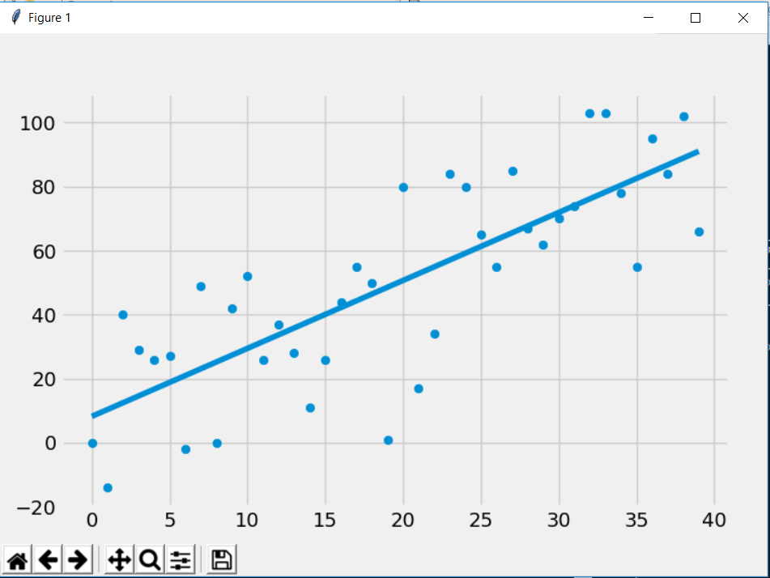
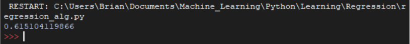

# Regression
This is a machine learning program written in python. Regression can be used to make prediction about the future. For example you could used it 
to predict how the stock market will operate based off of stock prices.



The number below represent how accurate the prediction is. So .62 means 62% accurate.




The code below is the data part of the code that filter out the unneccessary part of the data from quandl.  Quadl is a website were you can
get large amount of data for different applications.  The df.fillna(9999, inplace=True) basically just fills in any null data.  This must be done because the program cannot deal with null values.

```python
df = quandl.get('WIKI/GOOGL')
df = df[['Adj. Open', 'Adj. High', 'Adj. Low', 'Adj. Close', 'Adj. Volume', ]]
df['HL_PCT'] = (df['Adj. High'] - df['Adj. Close']) / df['Adj. Close'] * 100.0
df['PCT_change'] = (df['Adj. Close'] - df['Adj. Open']) / df['Adj. Open'] * 100.0

df = df[['Adj. Close', 'HL_PCT', 'PCT_change', 'Adj. Volume']]

forecast_col = 'Adj. Close'

df.fillna(-9999, inplace=True)
```
